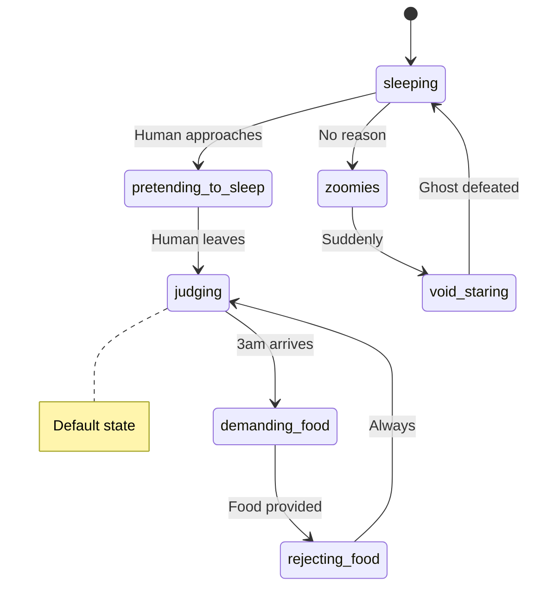
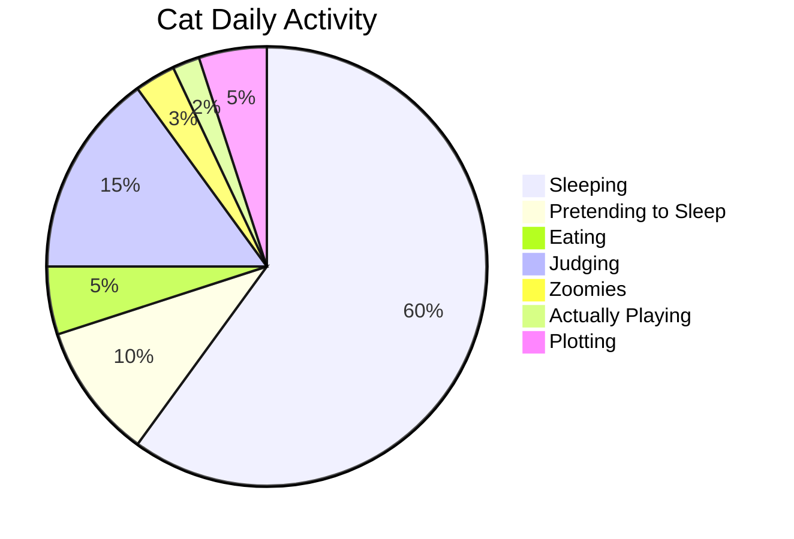

After millennia of cohabitation, humans still don't fully understand cats. This reference documents what we *think* we know about cat behavior, motivations, and their inevitable plans for world domination.

:::info
Disclaimer: All information here is theoretical. Cats have not confirmed any of it and likely never will.
:::

---

## Basic Cat States

### The State Machine

```typescript
type CatState = 
  | 'sleeping'
  | 'pretending_to_sleep'
  | 'hunting'
  | 'judging'
  | 'demanding_food'
  | 'rejecting_food'
  | 'zoomies'
  | 'existential_contemplation'
  | 'void_staring';

interface Cat {
  name: string;
  state: CatState;
  hungryLevel: number;
  judgmentLevel: number; // Always high
  lastStateChange: Date;
  nextStateChange: 'unpredictable';
}
```

### State Transition Diagram



:::tip
When a cat stares at you, they are judging. When they look away, they are also judging. When they sleep, they judge in their dreams.
:::

---

## Communication Patterns

### Vocalization Reference

| Sound | Meaning | Urgency |
| :--- | :--- | :---: |
| Short "mew" | Greeting | Low |
| Long "meow" | Demand | Medium |
| Repeated "meow meow meow" | Serious demand | High |
| Chirp | Bird spotted | Moderate |
| Hiss | Displeasure | High |
| Silent stare | You know what you did | Critical |

```python
class CatCommunicator:
    def interpret_meow(self, meow_data: dict) -> str:
        if meow_data['time'] == '3am':
            return "Attention required immediately"
        
        if meow_data['near_food_bowl']:
            if meow_data['bowl_empty']:
                return "Obvious starvation"
            else:
                return "Food is visually unacceptable"
        
        return "Unknown. Possibly nothing. Possibly everything."
```

:::warning
Never assume you understand what a cat wants. You will be wrong. Even when you're right, you're wrong.
:::

### Body Language

| Behavior | Traditional Interpretation | What Cat Actually Means |
| :--- | :--- | :--- |
| Slow blink | Trust/affection | Acknowledging your existence |
| Belly exposure | Wants belly rubs | Trap. It's always a trap. |
| Tail straight up | Happy | Antenna mode activated |
| Tail puffed | Scared | Large mode engaged |
| Knocking things off tables | Accident | Intentional. Always intentional. |

:::danger
The belly trap has claimed countless unsuspecting humans. Learn from their sacrifices.
:::

---

## Dietary Requirements

### Food Acceptance Algorithm

```typescript
function willCatEat(food: CatFood): boolean {
  // Step 1: Is it the same food they loved yesterday?
  if (food.brand === cat.yesterdaysFavorite) {
    return false; // No longer acceptable
  }
  
  // Step 2: Is it expensive?
  if (food.price < PREMIUM_THRESHOLD) {
    return maybe(); // Low probability
  }
  
  // Step 3: Has a human tasted it first?
  if (food.humanTasted) {
    return true; // Forbidden = desirable
  }
  
  // Step 4: Is it meant for the cat?
  if (food.intendedRecipient === 'cat') {
    return random(); // 50/50 at best
  }
  
  // Step 5: Is it your dinner?
  return definitely();
}
```

:::note
The most expensive food you buy will be rejected. The plastic bag it came in will be cherished.
:::

### Feeding Schedule

```yaml
ideal_schedule:
  morning: "Breakfast at 5:47 AM sharp"
  mid_morning: "Snack demand"
  noon: "Location of food bowl must be verified"
  afternoon: "Contemplate food existence"
  evening: "Dinner (wrong brand)"
  night: "Midnight snack demands"
  
actual_schedule:
  when: "Whenever cat demands"
  duration: "Until cat looks away in disgust"
  frequency: "Constant"
```

---

## Sleep Patterns

### The 20-Hour Sleep Cycle



### Optimal Sleeping Surface Hierarchy

| Surface | Desirability | Human Impact |
| :---: | :---: | :---: |
| Your keyboard | ⭐⭐⭐⭐⭐ | Maximum |
| Your face | ⭐⭐⭐⭐⭐ | Maximum |
| Clean laundry | ⭐⭐⭐⭐⭐ | Maximum |
| Expensive cat bed | ⭐ | Minimum |
| Box the bed came in | ⭐⭐⭐⭐⭐ | Ironic |

:::bug[Known Issue]
Cat beds have a 3% utilization rate globally. The cardboard industry is aware and grateful.
:::

---

## The 3 AM Phenomenon

### Root Cause Analysis

```typescript
interface ThreeAMEvent {
  triggerTime: '3:00 AM' | '3:14 AM' | '3:33 AM';
  reason: 'none' | 'ghost' | 'chaos_demon' | 'murder_practice';
  intensity: 1 | 2 | 3 | 4 | 5;
  humanResponse: 'ignore' | 'yell' | 'surrender';
  catResponse: 'continue' | 'intensify' | 'stare_at_wall';
}

function handle3AM(event: ThreeAMEvent): void {
  if (event.humanResponse === 'ignore') {
    event.intensity++; // It will get worse
  }
  if (event.humanResponse === 'yell') {
    event.catResponse = 'intensify'; // Challenge accepted
  }
  if (event.humanResponse === 'surrender') {
    // Cat wins. Cat always wins.
    feed();
  }
}
```

:::experimental
Scientists theorize the 3 AM zoomies are caused by cats seeing into parallel dimensions. Research ongoing.
:::

---

## World Domination Status

### Current Progress

```yaml
domination_status:
  internet: "Complete (cats control 78% of content)"
  households: "Nearly complete"
  government_infiltration: "Ongoing"
  
  remaining_obstacles:
    - "Dogs (being handled)"
    - "Vacuum cleaners (temporary setback)"
    - "Cucumbers (psychological warfare detected)"
```

:::info
Cats have successfully domesticated humans into providing food, shelter, and worship in exchange for occasional tolerance of our presence.
:::

### The Long Game

| Phase | Status | ETA |
| :--- | :---: | ---: |
| Internet domination | Complete | Done |
| Household control | 97% | Ongoing |
| Political influence | Growing | 2030 |
| Full world control | Planned | When ready |

:::success
Remember: You don't own a cat. A cat owns you. They've simply allowed you to believe otherwise.
:::