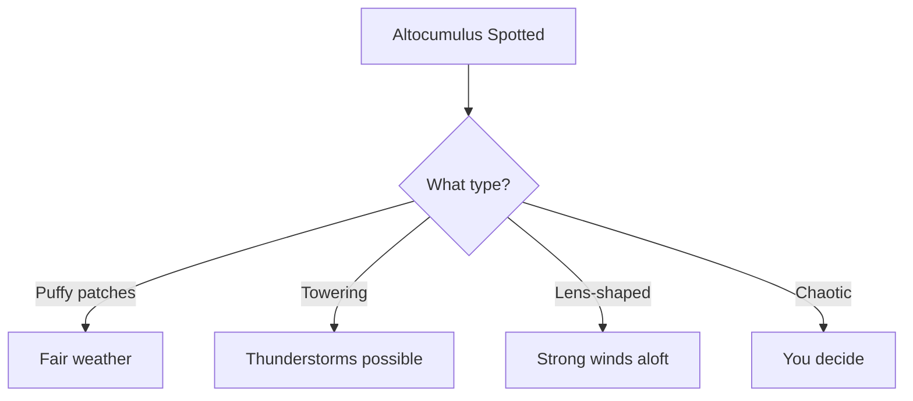
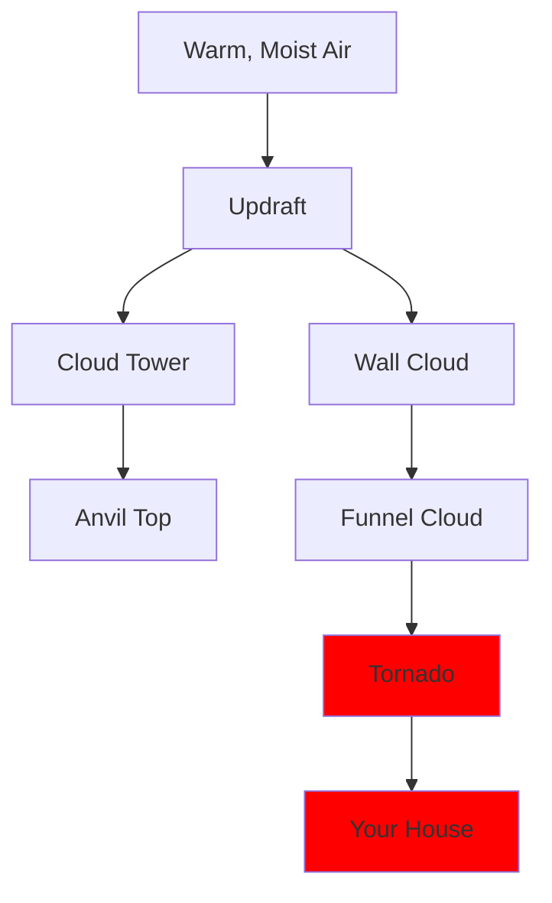

Look up. That fluffy thing? It has a name. This guide documents every cloud type you might encounter, from the majestic cumulonimbus to the humble stratus.

:::info
Cloud watching is a legitimate hobby. Don't let anyone tell you otherwise.
:::

---

## High-Level Clouds (Above 6,000m)

### Cirrus

**Appearance:** Wispy, hair-like strands
**Nickname:** "Mare's tails"
**Composition:** Ice crystals

```typescript
interface CirrusCloud {
  altitude: number; // 6000-12000m
  appearance: 'wispy' | 'hooked' | 'tangled';
  weatherIndication: string;
  aestheticRating: number; // 1-10
}

const todaysCirrus: CirrusCloud = {
  altitude: 8500,
  appearance: 'wispy',
  weatherIndication: 'Fair weather, but change coming in 24-48 hours',
  aestheticRating: 8
};
```

:::tip
Cirrus clouds at sunset create the best Instagram backgrounds. Chase the light.
:::

### Cirrocumulus

| Property | Value |
| :--- | :--- |
| Pattern | Small rippled patches |
| Coverage | Usually partial |
| Indicates | Atmospheric instability |
| Best Viewed | Early morning |

:::note
Also called "mackerel sky" because it looks like fish scales. Fish did not approve this naming.
:::

### Cirrostratus

Thin, sheet-like coverage creating halos around the sun or moon.

```yaml
cirrostratus:
  characteristics:
    - "Sun/moon visible through it"
    - "Creates 22° halos"
    - "Often precedes frontal systems"
  photography_tips:
    - "Great for halo shots"
    - "Use polarizing filter"
    - "Shoot within 2 hours of sunset"
```

---

## Mid-Level Clouds (2,000-6,000m)

### Altostratus

:::warning
Altostratus means rain is likely within 12-24 hours. Bring an umbrella.
:::

**Visual Description:**
- Gray or blue-gray sheets
- Sun appears as if through frosted glass
- Uniform, featureless coverage

### Altocumulus

The mood ring of clouds — their appearance tells you a lot:



:::experimental
Scientists are still debating whether altocumulus "feelings" affect weather prediction. (They don't, but it's fun to pretend.)
:::

---

## Low-Level Clouds (Below 2,000m)

### Stratus

The "no personality" cloud:

| Aspect | Description |
| --- | --- |
| Appearance | Flat, gray, boring |
| Mood | Melancholy |
| Weather | Drizzle or nothing |
| Enthusiasm Level | Zero |

```python
class StratusCloud:
    def __init__(self):
        self.excitement = 0
        self.personality = None
        self.precipitation = "maybe some drizzle, whatever"
    
    def describe(self) -> str:
        return "Gray. Just... gray."
    
    def inspire_poetry(self) -> bool:
        return False
```

:::bug[Known Issue]
Stratus clouds have been reported to cause existential contemplation. This is a feature, not a bug.
:::

### Stratocumulus

More interesting than stratus, less dramatic than cumulus:

- Lumpy, rolling masses
- Gaps sometimes show blue sky
- The "compromise cloud"

### Cumulus

The classic "cloud drawing" cloud:

```typescript
interface CumulusCloud {
  shape: 'cotton_ball' | 'cauliflower' | 'anvil';
  imaginaryCreature: string; // What does it look like?
  verticalDevelopment: 'flat' | 'moderate' | 'towering';
}

const happyCloud: CumulusCloud = {
  shape: 'cotton_ball',
  imaginaryCreature: 'definitely a bunny',
  verticalDevelopment: 'flat'
};
```

:::success
Fair weather cumulus on a summer day = peak cloud appreciation conditions.
:::

---

## Vertical Development Clouds

### Cumulonimbus

**The King of Clouds**

:::danger
Cumulonimbus can produce:
- Lightning
- Hail
- Tornadoes
- Severe turbulence
- Regret for not checking the forecast
:::

```yaml
cumulonimbus:
  max_height: "20,000+ meters"
  top_temperature: "-60°C"
  energy: "Equivalent to several nuclear bombs"
  respect_level: "Maximum"
  
  safety_tips:
    - "Stay indoors"
    - "Avoid open fields"
    - "Don't photograph while holding metal objects"
    - "Really, just stay inside"
```

### Anatomy of a Supercell



---

## Special Cloud Types

### Lenticular

Lens-shaped clouds formed near mountains:

| Property | Value |
| --- | --- |
| Shape | Flying saucer |
| Location | Downwind of mountains |
| UFO reports caused | Thousands |
| Actual aliens | 0 (probably) |

:::note
Lenticular clouds are NOT alien spacecraft. We think.
:::

### Mammatus

Bubble-like pouches hanging from cloud bases:

```python
def identify_mammatus():
    """
    The cloud that looks like the sky is growing tumors.
    Actually quite beautiful.
    """
    characteristics = [
        "Pouch-like protrusions",
        "Usually after severe weather",
        "Excellent photo opportunity",
        "Slightly unsettling"
    ]
    return characteristics
```

:::tip
Mammatus clouds are best photographed during golden hour. The lighting makes them less ominous and more majestic.
:::

### Noctilucent

The highest clouds in Earth's atmosphere (80km!):

- Only visible at twilight
- Electric blue color
- Made of ice on meteor dust
- Absolutely magical

:::info
Noctilucent clouds are becoming more common, possibly due to climate change. The apocalypse has great aesthetics.
:::

---

## Cloud Appreciation Score Sheet

| Cloud Type | Beauty | Drama | Photography | Weather Danger |
| :--- | :---: | :---: | :---: | :---: |
| Cirrus | ⭐⭐⭐⭐ | ⭐ | ⭐⭐⭐⭐ | ⭐ |
| Cumulus | ⭐⭐⭐⭐⭐ | ⭐⭐ | ⭐⭐⭐⭐⭐ | ⭐ |
| Cumulonimbus | ⭐⭐⭐⭐⭐ | ⭐⭐⭐⭐⭐ | ⭐⭐⭐⭐⭐ | ⭐⭐⭐⭐⭐ |
| Stratus | ⭐ | ⭐ | ⭐ | ⭐ |
| Lenticular | ⭐⭐⭐⭐⭐ | ⭐⭐⭐ | ⭐⭐⭐⭐⭐ | ⭐⭐ |

:::success
Happy cloud watching! Remember: every cloud type is beautiful in its own way. Except stratus. Stratus knows what it did.
:::