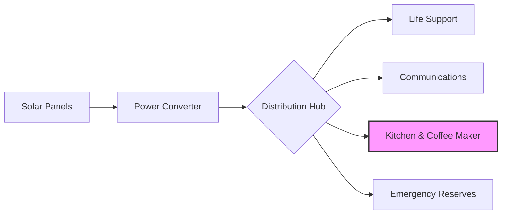
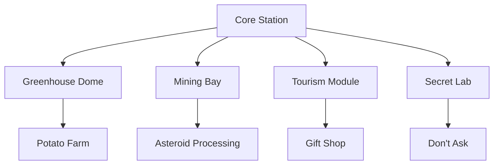

Welcome, aspiring space architect! In this tutorial, we'll walk through building your very own orbital space station. Along the way, you'll learn everything from selecting the right asteroid materials to debugging your life support systems.

:::info
This tutorial assumes you have basic knowledge of zero-gravity welding and at least three years of experience in theoretical astrophysics. Just kidding — anyone can build a space station!
:::

---

## Prerequisites

Before we begin construction, make sure you have the following:

- **A dream** — The most important ingredient
- **Coffee** — Lots of it (approximately 47 cups per module)
- **Duct tape** — The universal solution to all engineering problems
- **Internet connection** — For Stack Overflow when things go wrong

:::tip[Pro Tip]
Experienced space architects recommend starting with a small station (2-3 modules) before attempting a full orbital resort with swimming pools.
:::

---

## Module 1: Foundation Assembly

### Gathering Materials

Lorem ipsum dolor sit amet, consectetur adipiscing elit. The foundation of any good space station begins with **sturdy materials**. We recommend harvesting from nearby asteroids:

| Material | Source | Durability | Cost |
| :--- | :---: | :---: | ---: |
| Titanium Alloy | Belt Asteroid | Excellent | $$$$ |
| Recycled Satellites | Earth Orbit | Good | $$ |
| Moon Rocks | Luna Surface | Fair | $$$ |
| Space Debris | Anywhere | Variable | Free* |

*May contain traces of previous space stations

:::warning
Never use materials from asteroids with suspicious glowing green cores. Trust us on this one.
:::

### Structural Framework

Sed do eiusmod tempor incididunt ut labore et dolore magna aliqua. The framework connects all your modules together:

```typescript
interface SpaceModule {
  id: string;
  name: string;
  capacity: number;
  oxygenLevel: number;
  connectedModules: string[];
}

function connectModules(moduleA: SpaceModule, moduleB: SpaceModule): void {
  moduleA.connectedModules.push(moduleB.id);
  moduleB.connectedModules.push(moduleA.id);
  console.log(`Connected ${moduleA.name} to ${moduleB.name}`);
}

const habitationModule: SpaceModule = {
  id: "hab-001",
  name: "Living Quarters Alpha",
  capacity: 12,
  oxygenLevel: 100,
  connectedModules: []
};
```

:::example
Here's a real-world example: The ISS took over 10 years to construct and involved 16 nations. Your space station might take a weekend if you skip the paperwork.
:::

---

## Module 2: Life Support Systems

### Oxygen Generation

Ut enim ad minim veniam, quis nostrud exercitation ullamco laboris. Keeping your crew breathing is *somewhat important*:

1. Install the primary oxygen scrubbers
2. Connect backup algae farms
3. Test emergency oxygen masks
4. Label everything clearly (very important in zero-G)
5. Pray to your deity of choice

:::danger
**Critical Safety Notice:** Do NOT mix up the "Oxygen In" and "Oxygen Out" tubes. We've lost three interns this quarter alone.
:::

### Water Recycling

Duis aute irure dolor in reprehenderit in voluptate velit esse cillum dolore:

```python
class WaterRecycler:
    def __init__(self, efficiency: float = 0.95):
        self.efficiency = efficiency
        self.total_recycled = 0.0
    
    def process(self, dirty_water_liters: float) -> float:
        clean_water = dirty_water_liters * self.efficiency
        self.total_recycled += clean_water
        return clean_water
    
    def get_stats(self) -> dict:
        return {
            "efficiency": f"{self.efficiency * 100}%",
            "total_recycled": f"{self.total_recycled:.2f}L"
        }

# Initialize the recycler
recycler = WaterRecycler(efficiency=0.97)
today_output = recycler.process(100)
print(f"Produced {today_output}L of clean water")
```

:::note
Fun fact: Astronauts on the ISS drink recycled sweat. Your station can be fancier — consider adding lemon flavoring.
:::

---

## Module 3: Power Generation

### Solar Panel Configuration

Excepteur sint occaecat cupidatat non proident, sunt in culpa qui officia deserunt mollit anim id est laborum.



:::performance
Solar panels work best when pointed at the sun. This seems obvious, but you'd be surprised how many stations forget this crucial step.
:::

### Backup Power Systems

| System | Capacity | Recharge Time | Notes |
| --- | --- | --- | --- |
| Battery Bank A | 500 kWh | 4 hours | Primary backup |
| Battery Bank B | 500 kWh | 4 hours | Secondary backup |
| Hamster Wheels | 0.01 kWh | Continuous | Emergency only |
| Hope | Infinite | N/A | Last resort |

:::experimental
We're currently testing a new dark matter reactor. Results have been... *interesting*. Do not attempt at home.
:::

---

## Module 4: Communications Array

### Setting Up Your Antenna

Lorem ipsum dolor sit amet, consectetur adipiscing elit, sed do eiusmod tempor incididunt:

```bash
# Initialize the communications array
./antenna-init --frequency=2.4GHz --power=high

# Test Earth connection
ping earth --timeout=500ms

# If Earth doesn't respond, try:
ping mars --message="Anyone home?"

# Configure auto-response
echo "We're fine, everything's fine here. How are you?" > auto_reply.txt
```

:::info[Stay Connected]
Communication delays to Earth vary from 3 seconds to 20 minutes depending on orbital position. Plan your memes accordingly.
:::

### Emergency Protocols

Quis autem vel eum iure reprehenderit qui in ea voluptate velit esse:

- [x] Primary distress beacon installed
- [x] Backup distress beacon installed  
- [x] Tertiary distress beacon (the one that actually works)
- [ ] Trained carrier pigeons for analog backup
- [ ] Message in a bottle launcher

:::bug
**Known Issue:** The emergency beacon sometimes plays "Never Gonna Give You Up" instead of the distress signal. We're working on it.
:::

---

## Module 5: Habitation Quarters

### Room Layout

Nemo enim ipsam voluptatem quia voluptas sit aspernatur aut odit aut fugit:

```yaml
habitation_deck:
  rooms:
    - name: "Captain's Quarters"
      size: "20 sqm"
      amenities:
        - window_view: true
        - private_bathroom: true
        - espresso_machine: true
    
    - name: "Crew Bunks"
      size: "8 sqm each"
      amenities:
        - window_view: false
        - coffin_vibes: true
        - existential_dread: included
    
    - name: "Common Area"
      size: "50 sqm"  
      amenities:
        - zero_g_ping_pong: true
        - movie_nights: "Fridays"
```

:::success
Congratulations! You've completed the habitation module. Your crew can now complain about the accommodations in comfort.
:::

### Interior Design Tips

Sed ut perspiciatis unde omnis iste natus error sit voluptatem accusantium:

> "In space, no one can hear you scream about the terrible color choices in the break room."
> — Ancient Space Wisdom

:::tip
Use calming colors like blue and green. Avoid red — it makes everything look like an emergency, even breakfast.
:::

---

## Module 6: The Kitchen (Most Important)

### Coffee Machine Installation

**This is the most critical system on your station.** Everything else is secondary.

```typescript
interface CoffeeMachine {
  model: string;
  capacity: number;
  brewStrength: 'weak' | 'normal' | 'strong' | 'rocket-fuel';
  status: 'operational' | 'critical';
}

const stationCoffee: CoffeeMachine = {
  model: "Zero-G Espresso 3000",
  capacity: 50, // cups per hour
  brewStrength: 'rocket-fuel',
  status: 'operational'
};

function checkCoffeeStatus(machine: CoffeeMachine): string {
  if (machine.status !== 'operational') {
    return "🚨 STATION EMERGENCY: Coffee machine down!";
  }
  return "☕ All systems nominal";
}
```

:::danger[Mission Critical]
If the coffee machine fails, abort mission immediately. No coffee = no productivity = station falls out of orbit.
:::

### Food Storage

| Food Type | Storage Method | Shelf Life |
| --- | --- | --- |
| Freeze-dried meals | Vacuum sealed | 25 years |
| Fresh vegetables | Hydroponics bay | 2 weeks |
| Pizza | Doesn't exist in space 😢 | N/A |
| Regret | Everywhere | Forever |

:::deprecated
The old food tube system has been deprecated. Astronauts now eat actual food instead of toothpaste tubes.
:::

---

## Module 7: Recreation & Morale

### Entertainment Systems

Neque porro quisquam est, qui dolorem ipsum quia dolor sit amet:

```json
{
  "entertainment_options": {
    "movie_library": {
      "total_films": 10000,
      "favorites": ["Gravity", "The Martian", "Interstellar"],
      "banned": ["Alien", "Event Horizon"]
    },
    "games": {
      "console": "Space-Station 5",
      "vr_headsets": 6,
      "board_games": ["Monopoly (Space Edition)", "Settlers of Mars"]
    },
    "exercise": {
      "treadmill": true,
      "resistance_bands": 50,
      "yoga_mats": 12,
      "existential_screaming_room": true
    }
  }
}
```

:::note[Mental Health Matters]
Space madness is real. Schedule regular movie nights and discourage staring into the void for more than 30 minutes at a time.
:::

### Window Views

The observation deck provides stunning views of:

- Earth (when you're on the right side)
- The Moon (occasionally)
- Infinite darkness (mostly)
- Your own reflection looking tired

:::info
Fun activity: Try to spot your house from orbit. You can't, but it passes the time.
:::

---

## Troubleshooting Guide

### Common Problems and Solutions

:::warning[Houston, We Have Problems]
Here are the most common issues you'll encounter:
:::

#### Oxygen Levels Dropping

```bash
# Check scrubber status
./check-scrubbers --verbose

# If failing, switch to backup
./activate-backup --system=oxygen

# If all else fails
./panic --level=moderate
```

#### Mysterious Noises in Module 7

This is normal. It's probably just:

1. Thermal expansion
2. Micro-meteorite impacts
3. Dave from Engineering snoring
4. Something we don't talk about

:::bug[Known Issue]
The knocking sound from Storage Bay C has not been identified. We recommend ignoring it.
:::

#### Coffee Machine Error Codes

| Error Code | Meaning | Solution |
| --- | --- | --- |
| `E001` | Out of beans | Resupply immediately |
| `E002` | Water shortage | Cry |
| `E003` | Existential crisis | Give it a pep talk |
| `E404` | Coffee not found | Abandon station |

---

## Advanced Topics

### Station Expansion

Once your basic station is operational, consider these expansions:



:::experimental[Under Development]
We're working on warp drive integration. Current success rate: 0%. Current explosion rate: 87%.
:::

### Mathematical Considerations

Your orbital mechanics should follow:

**Orbital velocity:** $v = \sqrt{\frac{GM}{r}}$

**Orbital period:**

$$
T = 2\pi\sqrt{\frac{r^3}{GM}}
$$

Where:

- $G$ = Gravitational constant
- $M$ = Mass of Earth  
- $r$ = Orbital radius

:::tip
If the math gets too complicated, just wing it. Space is forgiving. (It's not. Don't wing it.)
:::

---

## Conclusion

Congratulations, space architect! You now know everything* needed to build your own orbital habitat.

**What we covered:**

- Foundation and structural assembly
- Life support systems (the boring but necessary stuff)
- Power generation (sun goes in, electricity comes out)
- Communications (for memes and occasionally emergencies)
- Habitation quarters (where you sleep and question your choices)
- The kitchen (the real heart of any station)
- Recreation (sanity not included)
- Troubleshooting (for when things inevitably go wrong)

:::success[You Did It!]
Your space station is now ready for launch. May your orbit be stable and your coffee machine never fail.
:::

---

## Quick Reference Card

| System | Status Check | Emergency Fix |
| :--- | :---: | ---: |
| Oxygen | `./check oxygen` | Breathe less |
| Power | `./check power` | Hamster wheels |
| Water | `./check water` | Recycling intensifies |
| Coffee | `./check coffee` | Full evacuation |
| Morale | Look around | Pizza party |

:::info[Need Help?]
If all else fails, contact Space Station Support at 1-800-FLOATING or submit a ticket through the airlock.
:::

---

*"Everything" is a strong word. We are not responsible for any stations that fall out of orbit, implode, explode, or get eaten by space whales. Build responsibly.

:::note
This document was written with 73% confidence and 100% caffeine. Any resemblance to actual space engineering is purely coincidental.
:::