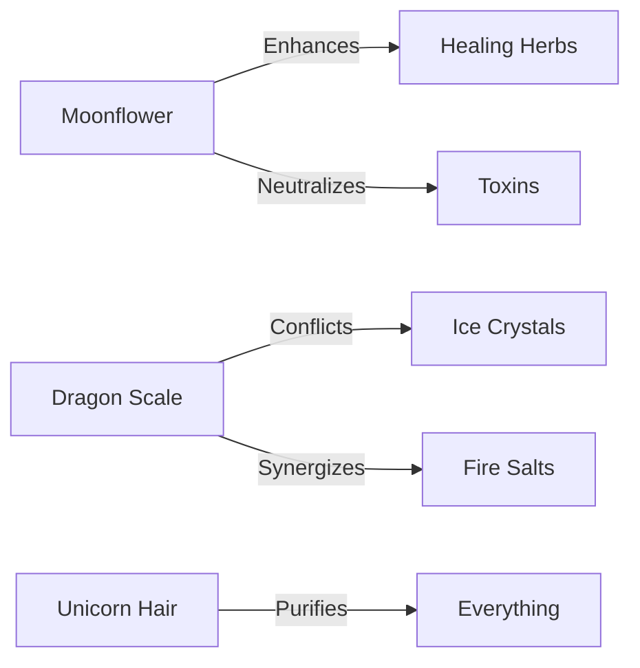

This reference documents all available potions, ingredients, and brewing methods in the Cauldron SDK v3.2.

:::info
All potions require a valid Brewing License. Unlicensed brewing may result in explosions, curses, or worse — audits.
:::

---

## Quick Start

```typescript
import { Cauldron, Ingredient, Potion } from '@magic/cauldron-sdk';

const cauldron = new Cauldron({
  size: 'medium',
  material: 'copper',
  enchantments: ['auto-stir', 'temperature-control']
});

const healthPotion = await cauldron.brew({
  ingredients: ['moonflower', 'redcap-mushroom', 'spring-water'],
  temperature: 180,
  duration: '2 hours'
});
```

---

## Ingredient Reference

### Common Ingredients

| Ingredient | Effect | Rarity | Notes |
| :--- | :--- | :---: | ---: |
| Moonflower | Healing | Common | Harvest at night |
| Dragon Scale | Fire resistance | Rare | Ethically sourced only |
| Unicorn Hair | Purification | Very Rare | Donated, not plucked |
| Toad Sweat | Transformation | Common | Gross but effective |
| Phoenix Feather | Resurrection | Legendary | One-time use |

:::warning
Never substitute ingredients without consulting the Substitution Table. Swapping dragon scale for lizard skin WILL explode.
:::

### Ingredient Compatibility Matrix



---

## Potion Types

### `HealthPotion`

Restores vitality and heals minor wounds.

```typescript
interface HealthPotion extends Potion {
  healingPower: number; // 1-100
  duration: number; // in seconds
  sideEffects: string[];
}

const recipe: HealthPotion = {
  name: "Greater Health Potion",
  healingPower: 75,
  duration: 3600,
  sideEffects: ["mild euphoria", "temporary glow"]
};
```

:::tip
Add a drop of honey for better taste without affecting potency.
:::

### `InvisibilityPotion`

Renders the drinker invisible for a limited time.

```typescript
interface InvisibilityPotion extends Potion {
  opacity: number; // 0 = fully invisible
  duration: number;
  affectsClothing: boolean;
}
```

:::danger
The `affectsClothing` parameter defaults to `false`. Check twice before drinking in public.
:::

### `TransformationPotion`

Transforms the drinker into another creature.

| Target Form | Difficulty | Reversal Time |
| --- | --- | --- |
| Cat | Easy | 1 hour |
| Bird | Medium | 2 hours |
| Dragon | Expert | Good luck |
| Tax Collector | Forbidden | Eternal |

:::bug[Known Issue]
Transforming into aquatic creatures while indoors may cause flooding. We're working on a fix.
:::

---

## Brewing Methods

### `Cauldron.brew(options)`

Primary brewing method for all potions.

**Parameters:**

| Parameter | Type | Required | Default |
| --- | --- | :---: | --- |
| `ingredients` | `string[]` | Yes | — |
| `temperature` | `number` | No | 100°C |
| `duration` | `string` | No | "1 hour" |
| `stirDirection` | `'clockwise' \| 'counter'` | No | "clockwise" |

**Returns:** `Promise<Potion>`

```typescript
const potion = await cauldron.brew({
  ingredients: ['wolfsbane', 'silver-dust', 'moonwater'],
  temperature: 150,
  duration: '3 hours',
  stirDirection: 'counter'
});
```

:::note
Counter-clockwise stirring is required for all curse-related potions. The magic has opinions.
:::

### `Cauldron.simmer(options)`

Low-temperature brewing for delicate ingredients.

```typescript
// Gentle brewing for sensitive ingredients
const delicatePotion = await cauldron.simmer({
  ingredients: ['fairy-dust', 'morning-dew', 'butterfly-wings'],
  temperature: 45, // Never exceed 50°C
  duration: '6 hours'
});
```

:::warning
Fairy dust ignites above 50°C. The cleanup is not worth it.
:::

---

## Error Handling

### Common Exceptions

```typescript
try {
  const potion = await cauldron.brew(recipe);
} catch (error) {
  if (error instanceof IngredientConflictError) {
    console.log("Incompatible ingredients detected");
  } else if (error instanceof CauldronOverflowError) {
    console.log("Too many ingredients! Duck!");
  } else if (error instanceof CurseBackfireError) {
    console.log("The curse returned to sender");
    // Seek medical attention immediately
  }
}
```

### Error Codes

| Code | Name | Solution |
| --- | --- | --- |
| `E001` | Temperature exceeded | Let it cool, start over |
| `E002` | Ingredient missing | Check your pantry |
| `E003` | Cauldron cursed | Buy a new cauldron |
| `E404` | Potion not found | Recipe doesn't exist |
| `E666` | Demon summoned | Call an exorcist |

:::experimental
We're testing automatic demon banishment in v4.0. Beta testers needed (liability waiver required).
:::

---

## Best Practices

1. **Always label your potions** — Unlabeled bottles lead to very interesting mornings
2. **Clean your cauldron** — Residue affects future brews
3. **Source ethically** — Dragon scales from live dragons only with consent
4. **Test on plants first** — If the fern survives, you probably will too
5. **Keep antidotes handy** — Mistakes happen

:::success
Happy brewing! May your potions be potent and your explosions be minor.
:::