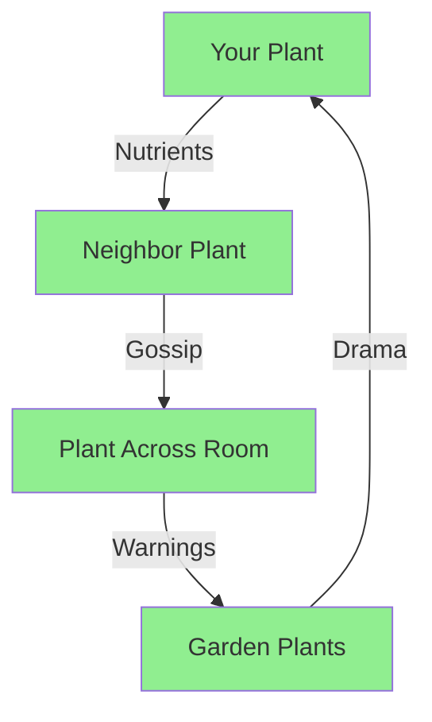

Plants have feelings too. Probably. This guide will teach you the art of plant communication, from basic greetings to negotiating with your houseplants about why they keep dying.

:::info
Studies show that talking to plants may improve their growth by 20%. Studies also show that talking to yourself is fine. Plants just give you an excuse.
:::

---

## Understanding Plant Language

### The Basics

Plants communicate through:

- Chemical signals
- Root networks
- Subtle leaf movements
- Passive-aggressive wilting

```typescript
interface PlantResponse {
  leafPosition: 'perky' | 'droopy' | 'dramatic';
  soilMoisture: number;
  colorHealth: string;
  vibes: 'good' | 'bad' | 'judgmental';
}

function interpretPlant(response: PlantResponse): string {
  if (response.leafPosition === 'dramatic' && response.vibes === 'judgmental') {
    return "You forgot to water me again, didn't you?";
  }
  return "All is well in plant world";
}
```

:::tip
Plants are excellent listeners. They won't interrupt, offer unsolicited advice, or tell anyone your secrets.
:::

---

## Conversation Starters

### For Different Plant Types

| Plant Type | Good Topics | Avoid Discussing |
| :--- | :--- | :--- |
| Succulents | Drought survival, minimalism | Your overwatering habits |
| Ferns | Humidity, ancient history | The Cretaceous extinction |
| Cacti | Personal boundaries | Hugs |
| Orchids | Self-care, luxury | Your other plants |

:::warning
Never discuss salads in front of leafy greens. It's considered extremely rude.
:::

### Sample Dialogues

**Morning Greeting:**
```
You: "Good morning, beautiful!"
Plant: *exists photosynthetically*
You: "You're looking green today."
Plant: *continues existing*
```

**Negotiation:**
```
You: "Please stop dying."
Plant: *droops slightly*
You: "I'll move you to better light."
Plant: *droops more*
You: "AND buy you fancy fertilizer?"
Plant: *perks up 0.003 degrees*
```

:::note
Plants respond to tone more than words. Screaming "WHY WON'T YOU LIVE" is counterproductive.
:::

---

## Advanced Techniques

### The Root Network Protocol

Plants communicate underground through mycorrhizal networks (the "Wood Wide Web"):



:::experimental
We're developing Plant-Fi™ technology to tap into these networks. Current translation accuracy: 2%.
:::

### Emotional Support Techniques

Plants experience stress from:

1. Inconsistent watering
2. Sudden temperature changes
3. Being moved too often
4. Hearing you talk about replacing them

```python
class PlantTherapy:
    def __init__(self, plant_name: str):
        self.patient = plant_name
        self.sessions_completed = 0
    
    def validate_feelings(self) -> str:
        return f"I hear you, {self.patient}. Your feelings of dryness are valid."
    
    def compliment(self) -> str:
        compliments = [
            "Your chlorophyll is looking vibrant today!",
            "That's a lovely new leaf you're growing.",
            "You're doing great at photosynthesis!"
        ]
        return random.choice(compliments)
    
    def apologize_for_neglect(self) -> str:
        return "I'm sorry I forgot about you. It won't happen again.*"
        # *It will definitely happen again
```

---

## Troubleshooting Communication

### Plant Not Responding?

:::bug[Known Issue]
Some plants are introverts. Give them space.
:::

| Symptom | Likely Cause | Solution |
| --- | --- | --- |
| Complete silence | Normal plant behavior | Continue talking anyway |
| Yellow leaves | Overwatering OR underwatering | Figure it out yourself |
| Dramatic leaf drop | Attention seeking | More compliments |
| Growing toward window | Trying to escape | Accept rejection gracefully |

### Emergency Phrases

When your plant is struggling:

```bash
# Encouragement
echo "You can do this! Photosynthesize!"

# Apology
echo "I'm sorry about the vacation. I thought you'd be fine for two weeks."

# Negotiation
echo "Please just grow one more leaf. Just one."

# Acceptance
echo "I'll miss you. You were a good plant."
```

:::danger
If your plant starts talking back audibly, consult a professional. Or water it less.
:::

---

## Building Long-Term Relationships

### The Plant-Human Bond

```yaml
relationship_stages:
  stage_1:
    name: "Acquaintance"
    duration: "1-2 weeks"
    activities:
      - "Basic greetings"
      - "Learning water preferences"
      - "Googling why leaves are yellow"
  
  stage_2:
    name: "Friendship"
    duration: "1-3 months"
    activities:
      - "Giving plant a name"
      - "Apologizing for neglect"
      - "Buying better pot"
  
  stage_3:
    name: "Family"
    duration: "3+ months"
    activities:
      - "Including in holiday photos"
      - "Panicking when sick"
      - "Propagating babies"
```

:::success
May your conversations be fruitful and your plants ever green. Remember: they're always listening, even if they can't respond.
:::