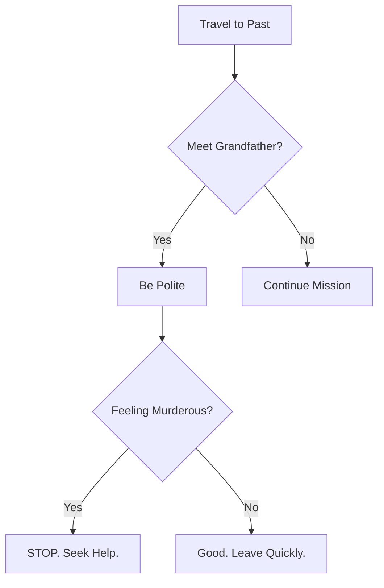

Congratulations on acquiring your temporal displacement device! Before you start paradox-hopping through history, please review these essential guidelines.

:::danger
The Temporal Affairs Bureau is watching. Always.
:::

---

## The Golden Rules

### Rule #1: Don't Kill Your Grandfather

This seems obvious, but you'd be surprised. Every year, thousands of time travelers accidentally prevent their own existence.



### Rule #2: No Spoilers

:::warning[Seriously]
Do NOT tell anyone about future events. Not sports scores, not stock prices, not who wins the war. Nothing.
:::

Acceptable conversation topics in the past:

- The weather (but not climate change)
- Local food recommendations
- Complimenting their primitive technology
- Asking for directions

### Rule #3: Blend In

| Era | Recommended Attire | Common Mistakes |
| :--- | :--- | :--- |
| Medieval | Peasant garb | Mentioning democracy |
| Victorian | Formal wear | Using contractions |
| 1950s | Period-appropriate casual | Knowing any science |
| 1980s | Neon everything | Actually blending in |

---

## Navigating Historical Periods

### Ancient Rome

:::tip
Learn Latin basics before visiting. "Where is the bathroom?" is "Ubi est latrina?"
:::

```python
roman_phrases = {
    "hello": "Salve",
    "goodbye": "Vale", 
    "please_dont_feed_me_to_lions": "Noli me leonibus pascere",
    "is_this_wine_safe": "Estne hoc vinum tutum?"
}
```

### The Renaissance

:::info
Artists are always broke. Offering to buy them lunch will get you surprisingly far.
:::

### The Industrial Revolution

- Don't mention unions
- Pretend to be impressed by steam
- Child labor is normal (don't make a scene)
- Bring your own water

---

## Emergency Protocols

### You've Created a Paradox

```bash
# Assess paradox severity
./temporal-scan --type=paradox --severity=check

# Minor paradox (butterfly effect)
./correct-timeline --method=subtle

# Major paradox (you don't exist anymore)
./emergency-return --ignore-causality=true
```

:::bug[Known Issue]
If you see yourself, do NOT make eye contact. The paperwork alone will take three centuries.
:::

### You're Stuck

Timeline getting weird? Try these steps:

1. Stay calm
2. Find a newspaper to confirm the date
3. Locate your nearest temporal anchor
4. If all else fails, wait it out (you have literally all the time)

:::note
Remember: Paradoxes resolve themselves 73% of the time. The other 27% result in alternate timelines, which is someone else's problem.
:::

---

## Souvenirs Policy

### Allowed

- Photographs (no flash before 1839)
- Memories
- Recipes
- Stories

### Prohibited

- Historical artifacts
- People
- Diseases (in either direction)
- Winning lottery numbers

:::success
Safe travels through time! Remember: the best timeline is the one where you return safely.
:::