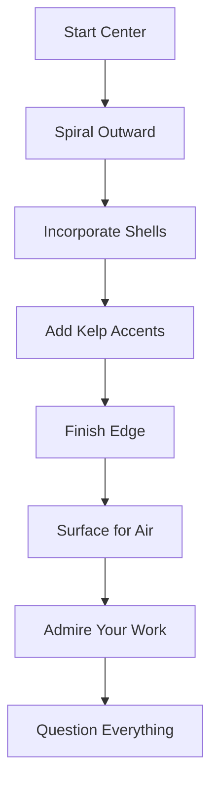

Welcome to the most impractical skill you'll ever learn. Underwater basket weaving combines the meditative practice of traditional weaving with the unnecessary complexity of doing it while holding your breath.

:::info
This course satisfies no degree requirements but provides immense personal satisfaction.
:::

---

## Equipment Needed

### Essential Gear

- Waterproof basket materials (reed, synthetic fiber, or kelp)
- Diving mask and snorkel
- Weighted workbench
- Industrial-strength patience
- A complete disregard for practicality

:::tip
Invest in a good mask. Nothing ruins basket weaving like constantly adjusting your goggles.
:::

### Optional Upgrades

| Item | Purpose | Worth It? |
| :--- | :--- | :---: |
| Oxygen tank | Extended sessions | Yes |
| Underwater lights | See your work | Definitely |
| Waterproof radio | Entertainment | Questionable |
| Trained dolphin assistant | Moral support | Absolutely |

---

## Basic Techniques

### The Foundation Weave

```python
class UnderwaterBasket:
    def __init__(self, material: str, depth: float):
        self.material = material
        self.depth = depth  # in meters
        self.structural_integrity = 100
        
    def weave_base(self, pattern: str = "radial") -> bool:
        if self.depth > 10:
            print("Warning: Increased pressure affects dexterity")
        
        # Start with 8 spokes
        spokes = self.create_spokes(count=8)
        return self.interlock_spokes(spokes, pattern)
    
    def add_row(self) -> None:
        if self.check_breath() < 20:
            raise SurfaceForAirException("You need oxygen!")
        # Continue weaving...
```

:::warning
Always weave WITH the current, never against it. Your basket will thank you.
:::

### Breathing Rhythm

Proper breathing is essential:

1. **Inhale** — At the surface, fill lungs completely
2. **Descend** — Slow, controlled movements
3. **Weave** — 3-4 strokes per breath hold
4. **Ascend** — When you see spots, it's time
5. **Repeat** — Until basket is done or you question your life choices

:::danger
If you black out underwater, your basket will remain unfinished. Prioritize consciousness.
:::

---

## Advanced Patterns

### The Coral Reef Spiral



### The Deep Sea Diamond

This pattern requires:

- Minimum 15-meter depth
- Advanced breath-holding (3+ minutes)
- Complete disregard for common sense
- A very understanding dive buddy

:::note
The Deep Sea Diamond has a 12% completion rate. The other 88% surface early, wet and frustrated.
:::

---

## Troubleshooting

### Common Problems

:::bug[Known Issue]
Fish often mistake baskets for nests and attempt to lay eggs. This is considered a compliment.
:::

| Problem | Cause | Solution |
| --- | --- | --- |
| Basket floats away | Insufficient weighting | Add rocks to base |
| Material dissolves | Wrong reed type | Use synthetic alternatives |
| Attacked by curious octopus | Looking delicious | Weave faster |
| Forgot pattern mid-weave | Oxygen deprivation | Surface immediately |

### Emergency Procedures

```bash
# If lost underwater
./find-surface --direction=up

# If basket stolen by mermaid
./negotiate --offer=different-basket

# If encountering sea monster
./abandon-basket --priority=survival
```

:::success
Congratulations! You now know more about underwater basket weaving than 99.9% of the population. Use this knowledge wisely (or at parties).
:::